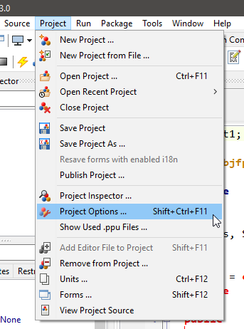
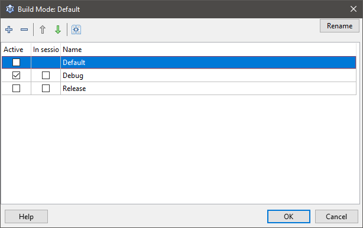
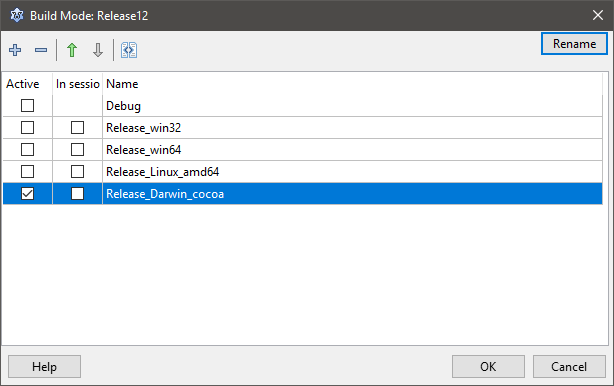

# FPC/Lazarus Notes
#### *Preamble*

About 7 years ago, when I had thoughts to turn Pascal coding from a favorite hobby into a means of earning money, I began to think about the license purity of my programs.

Since I am not a professional programmer, the thought of buying a Delphi had to be dismissed immediately. In addition, the lack of cross-platform functionality and the insane marketing policy of the companies that owned Delphi did not inspire optimism at all and discouraged any desire to invest money there.

IMHO, just by this time FPC / Lazarus from a raw open source project of a handful of enthusiasts began to turn into a quite serious tool. Of course, at some points Lazarus is still very far from Delphi (for example, the latter's debugger is an order of magnitude more convenient and functional). But the Lazarus code editor with its highlighting and other goodies leaves Delphi far behind. Plus, Lazarus is ABSOLUTELY FREE. And cross-platform. And bugs in it are corrected, if not hourly, then definitely daily.

But, like any open source, FPT/Lazarus requires manual assembly and tuning. And there is very little intelligible literature on it. Therefore, I decided to post my experience of using them in the form of articles.

I would be glad if this material helps anyone.

Zoltanleo, aka Док (2021г.)

## Biulding FPC/Lazarus. 

### Biulding via batch files

Coming soon ...

### Biulding via fpcupdeluxe

Coming soon ...

## Cross compilation to FPC

### Installing the crosscompiler 

We will assume that the compiler and lazarus are already installed using [fpcupdeluxe](https://github.com/LongDirtyAnimAlf/fpcupdeluxe/releases) and the "set install path" field contains the folder with installed fpc / lazarus

Go to the "cross" tab

Select the bitness of the processor and the OS.

*Note *: you can build a crosscompiler for a processor of a different bit capacity on the current platform. The main thing to remember is what bit depth you have running fpcupdeluxe (oftthe sware shown on the screenshot collects a 64-bit fpc for Windows, which means that the x32/i386 compiler assembly will be the "cross-platform" for Windows, etc.)

#### Windows

Select `CPU = i386` and ` OS = Windows` respectively, and click "Install compiler". Say "Yes" to both dialogues

 

The x32 compiler should build easily without any additional hassle.

*Note*: how to make the build mode of the executable file under x32, see [next chapter](###Build-modes-for-cross-compiler).

#### Linux

Since the assemblies of the crosscompiler for i386 and amd64 are identical, I will describe the process for the last listed one.

Select `CPU=x86_64` and ` OS=linux` respectively, and click "Install compiler". Say "Yes" to both dialogues

  

and wait until the utility informs us that it does not currently have a tool for building the crosscompiler. Then she will offer to download them

If we agree, we will be able to observe the process of downloading and unpacking

Then we patiently wait for building end.

*Note*: how to make the build mode of the executable file under i386/amd64, see [next chapter](###Build-modes-for-cross-compiler).

#### Darwin

Since for testing my projects under MacOS I use its hackintosh assemblies in a virtual machine that use an x86_64 processor, here I will describe the process of building a crosscompiler of this architecture.

Select `CPU=x86_64` and ` OS=Darwin` respectively, and click "Install compiler". Say "Yes" to both dialogues

 

and wait until the utility informs us that it does not currently have a tool for building the crosscompiler. Then she will offer to download them

 

If we agree, we will be able to observe the process of downloading and unpacking

Then we patiently wait for building end.

*Note*: how to make the build mode of the executable file under x86-64, see [next chapter](###Build-modes-for-cross-compiler).

### Build modes for cross compiler

To build executable files for different platforms using the cross compiler(s), you need to configure the appropriate build modes in your project. To do this, open your project by Lazarus and open the project properties

In the tree that opens, find "Compiler options" item and proceed to setting the "Build modes" by clicking on the button with the ellipsis

By default, Lazarus has one build mode ("Default"), which builds an executable file with debug information.

*In this case, the executable file in the "Default" mode will correspond to the bitness of the compiler (as we remember from the previous chapter, the bitness of the compiler will correspond to the bitness of fpcupdeluxe, with which it was assembled).*

 

Click on the "Create Debug and Release modes" button to create separate debug and release modes.

Now you can delete the "Default" mode and add a couple of more release modes for our needs, remembering to rename them accordingly

Now close the window and set up your modes.

Go to the settings tree to the "Config and Target" item

Sequentially selecting the specified build modes in the "Build modes" drop-down list, set the appropriate settings for each of them:

| Mode                 | OS     | CPU    | Note                                                         |
| -------------------- | ------ | ------ | ------------------------------------------------------------ |
| Debug                |        |        | do not change the default settings! (if only you are sure of your actions) |
| Release_win32        | win32  | i386   | Don't uncheck the "Win32 GUI application" checkbox!          |
| Release_win64        | win64  | x86_64 | Don't uncheck the "Win32 GUI application" checkbox!          |
| Release_linux_i386   | Linux  | i386   | Don't uncheck the "Win32 GUI application" checkbox!          |
| Release_linux_amd64  | Linux  | x86_64 | Don't uncheck the "Win32 GUI application" checkbox!          |
| Release_Darwin_Cocoa | Darwin | x86_64 | Be sure to uncheck "Win32 GUI application"! See note         |

*Note*: since each OS uses different widgetsets to display controls on the form(s), then for "my" MacOS (I wrote that I use Darwin with Cocoa widgets in the [previous chapter](####Darwin)) additional settings.

It is necessary to uncheck "Win32 GUI application"

and click to link "Select another widgetset" (or go to "Additions and Overrides" item in the project tree)

 

Select the "Value "Cocoa" item in the "SetLCLWidgetType" drop-down list, and make sure that there is a check mark next to this build mode.

and close the dialog.

If you start building a project in different modes, then all executable files will be compiled under the same name and in the same folder and sometimes will differ only in extension. To avoid this, I make a few more changes to the project properties using IDE macros.

Допустим, файл моего проекта имеет название "fbutil_wrapper.lpi". Для debug-режима я указываю для выходного файла (поле "Target file name") значение: 

For debug mode, I specify the value for the output file (the "Target file name" field): `debug\$NameOnly($(ProjFile))-debug`

and for "release" assemblies, I set the value: `release\$NameOnly($(ProjFile))-$(TargetCPU)-$(TargetOS)`

Let's say my project file is named "fbutil_wrapper.lpi". Then the finished files get the following names

### Building process of applications via a crosscompiler

To quickly select the build mode, you can use the toolbar or the corresponding menu item. You can build files individually or build all in one pass

   

**An important point(!)**: if the building process is for another platform, then you cannot build/compile the project using `<F9>` - you will get an error about the impossibility to run the executable file. It is necessary to build/compile an executable file using (if by default) `<Shift>+<F9>`/`<Ctrl>+<F9>`.

